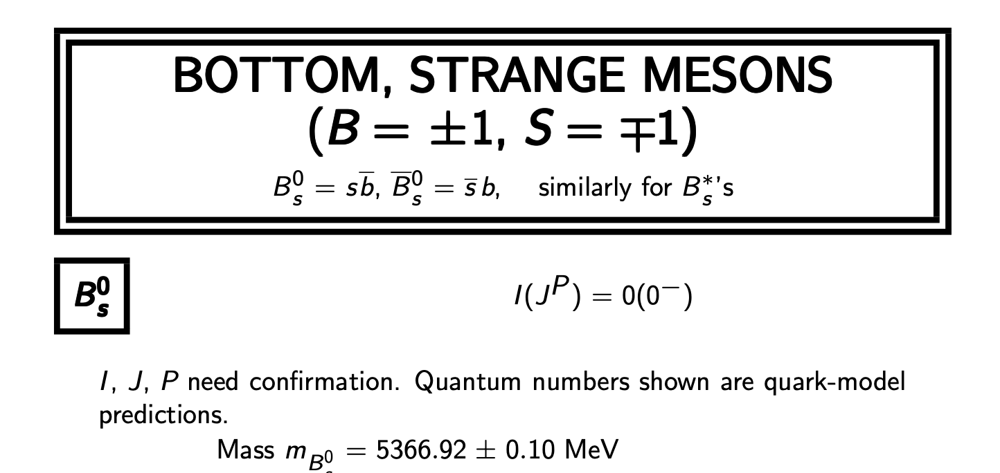
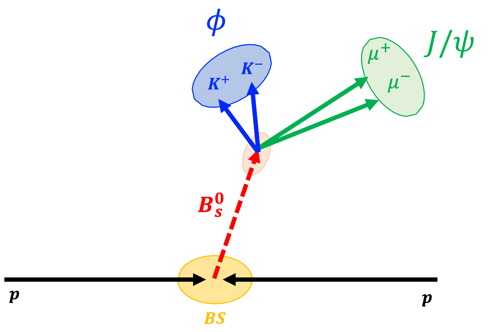

# µµTrkTrk reconstruction in MiniAOD 

## The setup
This package is mean to be run using Ultra Legacy MINIAODv2

* Setup in `13_1_0` 

```
scram p -n cmssw CMSSW_13_1_0
cd cmssw/src/
cmsenv
git clone git@github.com:AdrianoDee/2mu2trk_exercise.git -b jpsiphi MuMuTrkTrk/MuMuTrkTrk/
scram b -j 8
```

To run the example on `/RelValBsToJpsiPhi_mumuKK_14TeV/CMSSW_13_0_0_pre3-130X_mcRun3_2022_realistic_v2-v1/MINIAODSIM`

If you haven't, set up your certificate to access the data:
```
voms-proxy-init -rfc -voms cms -valid 192:00
```

Then simply run the config
```
cmsRun MuMuTrkTrk/MuMuTrkTrk/test/run-jpsikk-miniaodsim.py
```

----

## The Decay

The decay we want to reconstruct a $B^0_s$ meson candidate decaying as:

$$B_s^0 \to J/\psi(\to \mu\mu)\phi(\to KK)  $$

a bottom strange meson ($s\bar{b}$). You can find further information in the [PDG](https://pdg.lbl.gov/2023/web/viewer.html?file=../tables/rpp2023-tab-mesons-bottom-strange.pdf).



We can sketch the decay topology as follows:



the $B_s^0$ candidate, before decaying, flies (given the non negligible lifetime) w.r.t the collision area (beam spot) and it decays in:
- $J/\psi$ meson, a $c\bar{c}$ bound state with a mass of $\sim 3096 MeV$(see the [PDG](https://pdg.lbl.gov/2023/web/viewer.html?file=../tables/rpp2023-tab-mesons-c-cbar.pdf) for further details) 
- $\phi$ meson ($s\bar{s}$) a mass of $\sim 1020 MeV$(see the [PDG](https://pdg.lbl.gov/2023/tables/contents_tables_mesons.html ) for further details).

The $J/psi$ and the $\phi$ then furhterly decay into a pair of opposite sign muons and a pair of opposite sign kaons, almost promptly w.r.t. the $B^0_s$ meson.

## The Analyzer

The analyzer chain steps run as follows (all the producer mentioned are under `MuMuTrkTrk/MuMuTrkTrk/(src|interface)`):
1. the `Onia2MuMuPAT` `EDProducer` looping on all the suitable muons (`pat::Muons`) build dimuon candidates compatible with a $J/\psi$.
2. the `OniaPseudoTrackTrackProducer` `EDProducer` gets the dimuon candidates produced above and try to attach to it two tracks compatible with two kaons coming from a $\phi$.
3. the `OniaRecoTrackTrackRootupler` `EDProducer` gets the parameters and the observables from the candidate produced and fill a `TTree` in a `ROOT` file. 

----

The `Onia2MuMuPAT` producer here is basically a copy of what you already find in the release (under `HeavyFlavorAnalysis/Onia2MuMu/` package) with the addition of few extra variables.

It takes in input a collection of `pat::Muons`

```cpp
  muons_(consumes<edm::View<pat::Muon>>(iConfig.getParameter<edm::InputTag>("muons")))
```

loops on them avoiding double counting

```cpp
//int intMuon = 0;
  // JPsi candidates only from muons
  for(View<pat::Muon>::const_iterator it = muons->begin(), itend = muons->end(); it != itend; ++it){
    // both must pass low quality
    if(!lowerPuritySelection_(*it)) continue;
    for(View<pat::Muon>::const_iterator it2 = it+1; it2 != itend;++it2){
      // both must pass low quality
      if(!lowerPuritySelection_(*it2)) continue;
...
```

builds a µµ candidate from their 4-momenta

```cpp
pat::CompositeCandidate myCand;
vector<TransientVertex> pvs;

// ---- no explicit order defined ----
myCand.addDaughter(*it, "muon1");
myCand.addDaughter(*it2,"muon2");

// ---- define and set candidate's 4momentum  ----
LorentzVector jpsi = it->p4() + it2->p4();
myCand.setP4(jpsi);
myCand.setCharge(it->charge()+it2->charge());

```

and try to make a vertex fit with their embedded tracks (if not available the candidate is not stored):

```cpp

// ---- fit vertex using Tracker tracks (if they have tracks) ----
if (it->track().isNonnull() && it2->track().isNonnull()) {

//build the dimuon secondary vertex
vector<TransientTrack> t_tks;
t_tks.push_back(theTTBuilder->build(*it->track()));  // pass the reco::Track, not  the reco::TrackRef (which can be transient)
t_tks.push_back(theTTBuilder->build(*it2->track())); // otherwise the vertex will have transient refs inside.
TransientVertex myVertex = vtxFitter.vertex(t_tks);

CachingVertex<5> VtxForInvMass = vtxFitter.vertex( t_tks );
```
Note that to run the vertex fitt you need to build a `reco::TransientTrack` with the `theTTBuilder`. The transient tracks keep extra information (such as magnetic field, geometry) not accessible to standard `reco::Track`s.


----

The `OniaRecoTrackTrackRootupler` producer takes the `pat::CompositeCandidate` µµ candidates built from the previous step and tries to attach two additional tracks. As a first step we run a preselection of the `pat::PackedCandidateCollection`

```cpp

if (Tracks.isValid() && !Tracks->empty()) {
    for (std::vector<pat::PackedCandidate>::const_iterator pp = Tracks->begin(); pp!= Tracks->end(); ++pp) {

    if (!pp->trackHighPurity() || !pp->hasTrackDetails()) continue;
    //Not all the packed candidates have a track attached, we check it. And additionaly we want an higPurityTrack

    //if(!pp->fromPV()) continue; //Here we are asking if the embedded track comes from a PV

    //if(pp->vertexRef().key()!=THEKEY) continue;  //here we can ask if the track comes from a specific PV (where THEKEY is the index of the vertex we are interested in in the PV collection)

    //std::cout<<" ######### I have kaons for you ######### "<<std::endl;
    const reco::Track* TheTrack = &pp->pseudoTrack();

    //if (TheTrack->pt()<0.5 || std::abs(TheTrack->eta())>2.5) continue;
    //Some custom selection

    if (TheTrack->charge()==0) continue;

    //std::cout<<" ######### K charge is not ZERO ######### "<<std::endl;
    if ( IsTheSame(*TheTrack,*pmu1) || IsTheSame(*TheTrack,*pmu2) ) continue;
    //std::cout<<" ######### Kaons does not match with Muons ######### "<<std::endl;

    kaons.push_back(*TheTrack);
    kaonsPV.push_back(pp->fromPV());
    refVtx.push_back(pp->vertexRef().key());
    pvAssocQ.push_back(pp->pvAssociationQuality());
    dzAssocPV.push_back(pp->dzAssociatedPV());

    [...]

    }
}
```

Note that not all the selections are turned on (some are commented). Then we loop on the selcted "kaons" (skipping double counting):

```cpp
for (unsigned int ii=0; ii<kaons.size();++ii) {
         reco::Track* Track1 = &kaons.at(ii);
         for (unsigned int jj=ii+1; jj<kaons.size();++jj) {
            reco::Track* Track2 = &kaons.at(jj);
            if (Track1 == Track2) continue;
```

The selection here:

```cpp

 //if(Track1->charge() * Track2->charge() >= 0) continue; // Right sign
//if(Track1->charge() * Track2->charge() <= 0) continue; // Wrong sign

```

is commented to keep both Right Sign (RS,charge==0) and Wrong Sign (WS,|charge|=2) combinations. WS is often useful to mimic the combinatorial background.

The final µµKK candidate is built by fitting togheter the four tracks (two from the muons and two from the packed PF candidates). We need again `reco::TransientTrack`:

```cpp
std::vector<reco::TransientTrack> MuMuTk;
MuMuTk.push_back(theB.build(*pmu1->innerTrack()));
MuMuTk.push_back(theB.build(*pmu2->innerTrack()));
MuMuTk.push_back(theB.build(*Track1));
MuMuTk.push_back(theB.build(*Track2));
```

Then to run a kinematic fit (i.e. a fit "aware" of the track masses and the possible mass constraints), we need to transform the tracks into "particles" with masses with a `KinematicParticleFactoryFromTransientTrack` object

```cpp
KinematicParticleFactoryFromTransientTrack pFactory;
const ParticleMass muMass(0.1056583);
float muSigma = muMass*1E-6;
const ParticleMass tk1Mass(Track1Mass_); ##Kaon mass Hypothesis: remember in CMS we have no PID!
float tk1Sigma = tk1Mass*1E-6;
const ParticleMass tk2Mass(Track2Mass_);
float tk2Sigma = tk2Mass*1E-6;
```

Then, mostly to improve the resolution, we apply a mass constraint to the µµ candidate, forcing the mass to be that of the $J/\psi$:

```cpp
ParticleMass mass_(ConstraintMass_);
std::vector<RefCountedKinematicParticle> allDaughters_;
allDaughters_.push_back(pFactory.particle (MuMuTk[0], muMass, float(0), float(0), muSigma));
allDaughters_.push_back(pFactory.particle (MuMuTk[1], muMass, float(0), float(0), muSigma));
allDaughters_.push_back(pFactory.particle (MuMuTk[2], tk1Mass, float(0), float(0), tk1Sigma));
allDaughters_.push_back(pFactory.particle (MuMuTk[3], tk2Mass, float(0), float(0), tk2Sigma));
```
note that in this context the order is important since the constraint is placed on the first two particles (the two µ) with a `TwoTrackMassKinematicConstraint` object:

```cpp
KinematicConstrainedVertexFitter constVertexFitter;
MultiTrackKinematicConstraint *onia_mtc = new  TwoTrackMassKinematicConstraint(mass_);
RefCountedKinematicTree TheParticleTree = constVertexFitter.fit(allDaughters_,onia_mtc);
```
The result of the fit is a `RefCountedKinematicTree` that has all the decay products stored in a tree we may navigate from top to bottom:

```cpp
TheParticleTree->movePointerToTheTop();
RefCountedKinematicParticle TheParticle = TheParticleTree->currentParticle();
RefCountedKinematicVertex TheDecayVertex = TheParticleTree->currentDecayVertex();
```
accessing the next particle with (even if we don't use it in the analyzer itself):
```cpp
TheParticleTree->movePointerToTheNextChild()
RefCountedKinematicParticle nextDaughter = TheParticleTree->currentParticle();
```

## The Config

We select the global tag suitable for the dataset we have
```python
process.GlobalTag = GlobalTag(process.GlobalTag, '130X_mcRun3_2022_realistic_v2', '')
```
this is something you can usually get from the dataset name itself.

Next step let's configure the inputs and the outputs with the `PoolSource` module and the `TFileService` (used to output a simple `ROOT` file).

```python
input_filename = ["/store/relval/CMSSW_13_0_0_pre3/RelValBsToJpsiPhi_mumuKK_14TeV/MINIAODSIM/130X_mcRun3_2022_realistic_v2-v1/00000/d26ae0bf-3a06-4098-9c24-c29452079aa0.root"]
ouput_filename = 'mumukk.root'
process.source = cms.Source("PoolSource",fileNames = cms.untracked.vstring(input_filename))
process.TFileService = cms.Service("TFileService",fileName = cms.string(ouput_filename))
```

Then we may select the events that has fired a specific trigger:

```python
triggers = [
'HLT_DoubleMu4_JpsiTrkTrk_Displaced', ##Run3 trigger!
]
```
this is a trigger dedicated to $J/\psi + 2 Tracks$ displaced topologies (exactly what we need!). The $4$ there is the $p_T$ threshold on the $2\mu$ system. So we add to the process a module to filter the events:

```
hltpathsV = cms.vstring([h + '_v*' for h in triggers ])
process.triggerSelection = cms.EDFilter("TriggerResultsFilter",
                                        triggerConditions = hltpathsV,
                                        hltResults = cms.InputTag( "TriggerResults", "", "HLT" ),
                                        l1tResults = cms.InputTag( "" ),
                                        throw = cms.bool(False)
                                        )

```

In `MINIAOD` the muons are stored under the `slimmedMuons` collection of `pat::Muons`. Instead of using all of them we may run a first selection based on a combination of cuts with the `PATMuonSelector` module: 

```python
process.oniaSelectedMuons = cms.EDFilter('PATMuonSelector',
   src = cms.InputTag('slimmedMuons'),
   cut = cms.string('muonID(\"TMOneStationTight\")'
                    ' && abs(innerTrack.dxy) < 0.3'
                    ' && abs(innerTrack.dz)  < 20.'
                    ' && innerTrack.hitPattern.trackerLayersWithMeasurement > 5'
                    ' && innerTrack.hitPattern.pixelLayersWithMeasurement > 0'
                    ' && innerTrack.quality(\"highPurity\")'
                    ' && (pt > 2.)'
   ),
   filter = cms.bool(True)
)
```
In this case, e.g., we are selecting muons:
- `innerTrack.hitPattern.pixelLayersWithMeasurement>0`, whose track has at least one pixel on at least one layer;
- `innerTrack.hitPattern.pixelLayersWithMeasurement>0`, whose track has at least one hit on at least five layers;
- `innerTrack.quality(\"highPurity\")`, an high purity track
- `pt > 2.`, etc...


Now it's the moment to build the µµ candidate. This is done through the `Onia2MuMuPAT` `EDProducer`

```python
### µµ building
process.load("MuMuTrkTrk.MuMuTrkTrk.onia2MuMuPAT_cfi")
process.onia2MuMuPAT.muons=cms.InputTag('oniaSelectedMuons') #using as input the selected muons
process.onia2MuMuPAT.primaryVertexTag=cms.InputTag('offlineSlimmedPrimaryVertices') #the PVs
process.onia2MuMuPAT.beamSpotTag=cms.InputTag('offlineBeamSpot') #the Bs
process.onia2MuMuPAT.higherPuritySelection=cms.string("") ## BOTH muons must pass this selection
process.onia2MuMuPAT.lowerPuritySelection=cms.string("") ## At least one muon must pass this selection
process.onia2MuMuPAT.dimuonSelection=cms.string("2.5 < mass && mass < 3.5") #mass window cuts
process.onia2MuMuPAT.addMCTruth = cms.bool(False) ## Not interested for the moment
```
Then we filter the vents based on the number of µµ candidate we find (at least 1), just to avoid to continue the process when there's none

```python
process.DiMuonCounter = cms.EDFilter('CandViewCountFilter',
    src       = cms.InputTag("Onia2MuMuFiltered"),
    minNumber = cms.uint32(1),
)
```

Finally the µµKK candidate is reconstructed.

```python

process.OniaPseudoTrackTrackCandidateProducer = cms.EDProducer('OniaPseudoTrackTrackProducer',
    Onia = cms.InputTag("Onia2MuMuFiltered"),
    BeamSpot = cms.InputTag('offlineBeamSpot'),
    Track = cms.InputTag("packedPFCandidates"), 
    OniaMassCuts = cms.vdouble(2.9,3.3), #J/Psi mass window, narrower than before
    CandidateMassCuts = cms.vdouble(4.0,6.0), #µµKK mass window
    Track1Mass = cms.double(0.493677),#kaon mass, for track refit hypothesis
    Track2Mass = cms.double(0.493677),
    ConstraintMass = cms.double(3.096916),#J/Psi mass constraint
)

```

The final step consist in writing in a simple `ROOT` `TTree` the observable we are interested in with the `OniaRecoTrackTrackRootupler`.

```python
process.rootuple = cms.EDAnalyzer('OniaRecoTrackTrackRootupler',
                          TheCandidates = cms.InputTag("OniaPseudoTrackTrackCandidateProducer"), # the µµKK candidates we have built
                          TheUps = cms.InputTag("Onia2MuMuFiltered"),
                          PrimaryVertices = cms.InputTag("offlineSlimmedPrimaryVertices"),
                          TriggerResults = cms.InputTag("TriggerResults", "", "HLT"),
                          GenParticles = cms.InputTag("prunedGenParticles"),
                          Track1Mass = cms.double(0.493677),
                          Track2Mass = cms.double(0.493677),
                          DimuonMass = cms.double(3.096916),
                          candidate_pdgid = cms.uint32(531),
                          onia_pdgid = cms.uint32(443),
                          ditrack_pdgid = cms.uint32(333),
                          track1_pdgid = cms.int32(321),
                          track2_pdgid = cms.int32(-321),
                          isMC = cms.bool(True), 
                          OnlyBest = cms.bool(False) #Selecting only the candidate with the best vertex probability
)
```

## The Notebook

The `bs_decay.ipynb` notebook under `MuMuTrkTrk/MuMuTrkTrk/test/`

It's easier if you follow the instructions directly there. If you want you may run this notebook in [SWAN](https://swan.web.cern.ch/swan/) from which you will be able to acces any area you have acces on `eos` (e.g. your `lxplus` home, in my case `/afs/cern.ch/user/a/adiflori`).


 <a href="https://cern.ch/swanserver/cgi-bin/go?projurl=https://raw.githubusercontent.com/AdrianoDee/2mu2trk_exercise/main/test/bs_decay.ipynb" target="_blank">
                            
                        </a>

## To you!

As an excercise you may try to modify the analyzer chain and the python config in order to reconstruct another decay with a similar daughters:

$$\psi(2S) \to J/\psi(\to \mu\mu)\pi\pi  $$

toJpsiPiPi")

There are some differences:

1. in this case the decay is __prompt__, meaning we expect all the candidates to come from a PV;
2. there is no constraint on the $\pi\pi$ system mass since they are non-resonant;
3. the $\psi(2S)$ has a lower mass w.r.t. the $B^0_s$

You can try to use the dataset

`/RelValPsi2SToJPsiPiPi_14TeV/CMSSW_13_0_0_pre3-130X_mcRun3_2022_realistic_v2-v1/MINIAODSIM`

that has the same GT.

(Suggestion: also the `HLT` you select will need to be changed, if you don't know which to use, simply turn off the selection.)

Another possibility is to check the PU datasets for $B^0_s$ such as:

`/RelValBsToJpsiPhi_mumuKK_14TeV/CMSSW_13_1_0_pre4-PU_131X_mcRun3_2022_realistic_v3_2023_BPH-v1/MINIAODSIM`

and see what happens. Beware! The GT is different!
